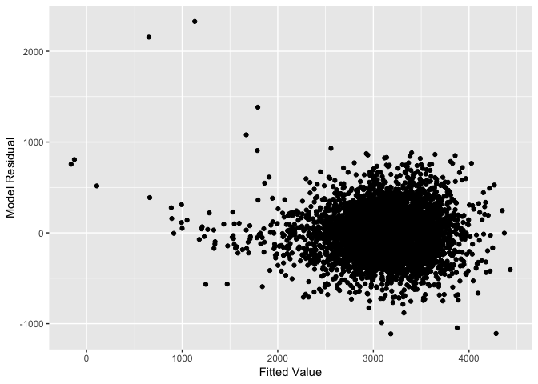

p8105\_hw6\_yw3236
================
Yishan Wang
2018-11-19

Problem 1
=========

``` r
homicides_data = read.csv("https://raw.githubusercontent.com/washingtonpost/data-homicides/master/homicide-data.csv")
```

``` r
new_homicides_data = homicides_data %>%
  mutate(city_state = paste(city, state, sep = ", ")) %>%
  mutate(resolved = as.numeric(disposition == "Closed by arrest")) %>% #factor???
  filter(city_state != "Dallas, TX" & city_state != "Phoenix, AZ" & city_state != "Kansas City, MO") %>%
  filter(city_state != "Tulsa, AL") %>%
  mutate(victim_race = ifelse(victim_race == "White", "white", "non-white"),
         victim_race = fct_relevel(victim_race, "white"),
         victim_age = as.numeric(victim_age))
```

``` r
fit_logistic = new_homicides_data %>%
  filter(city_state == "Baltimore, MD") %>%
  glm(resolved ~ victim_age + victim_race + victim_sex, data = ., family = binomial()) 
```

``` r
fit_logistic %>% 
  broom::tidy() %>% 
  mutate(OR = exp(estimate),
         CI_lower = exp(estimate - qnorm(0.975) * std.error),
         CI_upper = exp(estimate + qnorm(0.975) * std.error)) %>%
  filter(term == "victim_racenon-white") %>%
  select(OR, CI_lower, CI_upper, p.value) %>% 
  knitr::kable(digits = 3)
```

|     OR|  CI\_lower|  CI\_upper|  p.value|
|------:|----------:|----------:|--------:|
|  0.453|      0.322|      0.637|        0|

``` r
glm_function = function(city_data){
  
  city_data %>%
    nest(-city_state) %>%  #nest first
    mutate(glm = purrr::map(data, ~glm(resolved ~ victim_age + victim_race + victim_sex, data = ., family = binomial())),
           tidied = purrr::map(glm, broom::tidy)) %>%  #apply test
    unnest(tidied, .drop = TRUE) %>%  #unnest
    mutate(OR = exp(estimate),
           CI_lower = exp(estimate - qnorm(0.975) * std.error),
           CI_upper = exp(estimate + qnorm(0.975) * std.error)) %>%
    filter(term == "victim_racenon-white") %>%
    select(city_state, OR, CI_lower, CI_upper, p.value) %>%
    data.frame()
  
}
```

``` r
multicity_glm = glm_function(new_homicides_data)

multicity_glm
```

    ##            city_state        OR   CI_lower  CI_upper      p.value
    ## 1     Albuquerque, NM 0.6860531 0.41769744 1.1268177 1.366591e-01
    ## 2         Atlanta, GA 0.7667500 0.44043049 1.3348431 3.477621e-01
    ## 3       Baltimore, MD 0.4525206 0.32162029 0.6366977 5.331248e-06
    ## 4     Baton Rouge, LA 0.6558545 0.30741032 1.3992540 2.752534e-01
    ## 5      Birmingham, AL 1.0471153 0.62269277 1.7608210 8.621679e-01
    ## 6          Boston, MA 0.1205147 0.04963250 0.2926265 2.940514e-06
    ## 7         Buffalo, NY 0.4474175 0.24550184 0.8154008 8.629589e-03
    ## 8       Charlotte, NC 0.5550724 0.32506541 0.9478259 3.106466e-02
    ## 9         Chicago, IL 0.5751690 0.44124894 0.7497341 4.316150e-05
    ## 10     Cincinnati, OH 0.3269424 0.18968348 0.5635248 5.703613e-05
    ## 11       Columbus, OH 0.8844860 0.65711787 1.1905254 4.181399e-01
    ## 12         Denver, CO 0.5942632 0.35308656 1.0001761 5.007753e-02
    ## 13        Detroit, MI 0.6609813 0.49580808 0.8811801 4.769658e-03
    ## 14         Durham, NC 1.1528002 0.46059312 2.8852976 7.612982e-01
    ## 15     Fort Worth, TX 0.8527376 0.56467218 1.2877586 4.487759e-01
    ## 16         Fresno, CA 0.4574375 0.23648135 0.8848439 2.015723e-02
    ## 17        Houston, TX 0.9207334 0.73858545 1.1478022 4.627698e-01
    ## 18   Indianapolis, IN 0.5162217 0.39044128 0.6825223 3.471773e-06
    ## 19   Jacksonville, FL 0.6805895 0.51929321 0.8919855 5.299920e-03
    ## 20      Las Vegas, NV 0.7883387 0.61333000 1.0132848 6.332233e-02
    ## 21     Long Beach, CA 0.8428440 0.41252831 1.7220296 6.390576e-01
    ## 22    Los Angeles, CA 0.7176698 0.52454234 0.9819036 3.806605e-02
    ## 23     Louisville, KY 0.4336608 0.28801137 0.6529661 6.302610e-05
    ## 24        Memphis, TN 0.8066744 0.54102411 1.2027626 2.918345e-01
    ## 25          Miami, FL 0.5768849 0.37923895 0.8775371 1.015962e-02
    ## 26      Milwaukee, wI 0.6598363 0.42186855 1.0320369 6.848733e-02
    ## 27    Minneapolis, MN 0.6665973 0.35468100 1.2528216 2.077369e-01
    ## 28      Nashville, TN 0.8919720 0.64835104 1.2271348 4.824362e-01
    ## 29    New Orleans, LA 0.5105893 0.32582023 0.8001390 3.359309e-03
    ## 30       New York, NY 0.5481259 0.28832333 1.0420316 6.660181e-02
    ## 31        Oakland, CA 0.2174194 0.10662218 0.4433524 2.700626e-05
    ## 32  Oklahoma City, OK 0.7114617 0.50344208 1.0054339 5.369942e-02
    ## 33          Omaha, NE 0.1795682 0.09934289 0.3245803 1.304811e-08
    ## 34   Philadelphia, PA 0.6615811 0.49973950 0.8758354 3.899466e-03
    ## 35     Pittsburgh, PA 0.2896680 0.16576229 0.5061919 1.357498e-05
    ## 36       Richmond, VA 0.4882646 0.18278443 1.3042815 1.527033e-01
    ## 37    San Antonio, TX 0.6983376 0.46861044 1.0406841 7.772517e-02
    ## 38     Sacramento, CA 0.7743855 0.44708001 1.3413099 3.616313e-01
    ## 39       Savannah, GA 0.6437600 0.31355787 1.3216921 2.301312e-01
    ## 40 San Bernardino, CA 0.9462056 0.42593920 2.1019550 8.919929e-01
    ## 41      San Diego, CA 0.4339041 0.26685765 0.7055177 7.615544e-04
    ## 42  San Francisco, CA 0.4577118 0.29010830 0.7221444 7.817084e-04
    ## 43      St. Louis, MO 0.6010156 0.42391476 0.8521048 4.255904e-03
    ## 44       Stockton, CA 0.3954507 0.20783139 0.7524428 4.705254e-03
    ## 45          Tampa, FL 1.1845998 0.61216751 2.2923083 6.149962e-01
    ## 46          Tulsa, OK 0.5857297 0.40218967 0.8530285 5.291572e-03
    ## 47     Washington, DC 0.5268148 0.26665598 1.0407935 6.505641e-02

``` r
multicity_glm %>%
  ggplot() +
  geom_point(aes(x = reorder(city_state, OR), y = OR)) +  #order cities by the value of estimates
  geom_errorbar(aes(x = reorder(city_state, OR), ymin = CI_lower, ymax = CI_upper, OR)) +  #add error bar
  theme(axis.text.x = element_text(angle = 90, hjust = 1, size = rel(1))) +
  labs(x = "City", y = "OR Comparing Non-white Victims to White Victims (95% CI)")
```


Problem 2
=========

``` r
birthweight_data = read.csv("./data/birthweight.csv") %>%
  janitor::clean_names() %>%
  mutate(mrace = factor(mrace, levels = c("1", "2", "3", "4", "8")),
         malform = factor(malform, levels = c("0", "1")),
         frace = factor(frace, levels = c("1", "2", "3", "4", "8", "9")),
         babysex = factor(babysex, levels = c("1", "2")))

sapply(birthweight_data, function(x)sum(is.na(x)))
```

    ##  babysex    bhead  blength      bwt    delwt  fincome    frace  gaweeks 
    ##        0        0        0        0        0        0        0        0 
    ##  malform menarche  mheight   momage    mrace   parity  pnumlbw  pnumsga 
    ##        0        0        0        0        0        0        0        0 
    ##    ppbmi     ppwt   smoken   wtgain 
    ##        0        0        0        0

View(birthweight\_data)

``` r
# Explorations: pairwise correlations to identify collinearity 
Hmisc::rcorr(as.matrix(birthweight_data)) %>%
  broom::tidy() %>%
  mutate(abs_estimate = abs(estimate)) %>%
  filter(abs_estimate >= 0.5)
```

    ## # A tibble: 7 x 6
    ##   column1 column2 estimate     n p.value abs_estimate
    ##   <chr>   <chr>      <dbl> <int>   <dbl>        <dbl>
    ## 1 bhead   blength    0.630  4342       0        0.630
    ## 2 bhead   bwt        0.747  4342       0        0.747
    ## 3 blength bwt        0.743  4342       0        0.743
    ## 4 frace   mrace      0.829  4342       0        0.829
    ## 5 delwt   ppbmi      0.721  4342       0        0.721
    ## 6 delwt   ppwt       0.871  4342       0        0.871
    ## 7 ppbmi   ppwt       0.853  4342       0        0.853

``` r
# Fit a regression using all predictors except `pnumlbw` and `pnumsga`
mult.fit = lm(bwt ~ babysex + bhead + blength + delwt + fincome + frace + gaweeks + malform + menarche + mheight + momage + mrace + parity + ppbmi + ppwt + smoken + wtgain, data = birthweight_data)
summary(mult.fit)
```

    ## 
    ## Call:
    ## lm(formula = bwt ~ babysex + bhead + blength + delwt + fincome + 
    ##     frace + gaweeks + malform + menarche + mheight + momage + 
    ##     mrace + parity + ppbmi + ppwt + smoken + wtgain, data = birthweight_data)
    ## 
    ## Residuals:
    ##      Min       1Q   Median       3Q      Max 
    ## -1097.68  -184.86    -3.33   173.09  2344.15 
    ## 
    ## Coefficients: (1 not defined because of singularities)
    ##               Estimate Std. Error t value Pr(>|t|)    
    ## (Intercept) -6265.3914   660.4011  -9.487  < 2e-16 ***
    ## babysex2       28.7073     8.4652   3.391 0.000702 ***
    ## bhead         130.7781     3.4523  37.881  < 2e-16 ***
    ## blength        74.9536     2.0217  37.075  < 2e-16 ***
    ## delwt           4.1007     0.3948  10.386  < 2e-16 ***
    ## fincome         0.2898     0.1795   1.614 0.106551    
    ## frace2         14.3313    46.1501   0.311 0.756168    
    ## frace3         21.2361    69.2960   0.306 0.759273    
    ## frace4        -46.9962    44.6782  -1.052 0.292912    
    ## frace8          4.2969    74.0741   0.058 0.953745    
    ## gaweeks        11.5494     1.4654   7.882 4.06e-15 ***
    ## malform1        9.7650    70.6259   0.138 0.890039    
    ## menarche       -3.5508     2.8951  -1.226 0.220083    
    ## mheight         9.7874    10.3116   0.949 0.342588    
    ## momage          0.7593     1.2221   0.621 0.534418    
    ## mrace2       -151.4354    46.0453  -3.289 0.001014 ** 
    ## mrace3        -91.3866    71.9190  -1.271 0.203908    
    ## mrace4        -56.4787    45.1369  -1.251 0.210901    
    ## parity         95.5411    40.4793   2.360 0.018307 *  
    ## ppbmi           4.3538    14.8913   0.292 0.770017    
    ## ppwt           -3.4716     2.6121  -1.329 0.183913    
    ## smoken         -4.8544     0.5871  -8.269  < 2e-16 ***
    ## wtgain              NA         NA      NA       NA    
    ## ---
    ## Signif. codes:  0 '***' 0.001 '**' 0.01 '*' 0.05 '.' 0.1 ' ' 1
    ## 
    ## Residual standard error: 272.5 on 4320 degrees of freedom
    ## Multiple R-squared:  0.7183, Adjusted R-squared:  0.717 
    ## F-statistic: 524.6 on 21 and 4320 DF,  p-value: < 2.2e-16

``` r
# Remove wtgain
step1 = update(mult.fit, . ~ . -wtgain)
summary(step1)
```

    ## 
    ## Call:
    ## lm(formula = bwt ~ babysex + bhead + blength + delwt + fincome + 
    ##     frace + gaweeks + malform + menarche + mheight + momage + 
    ##     mrace + parity + ppbmi + ppwt + smoken, data = birthweight_data)
    ## 
    ## Residuals:
    ##      Min       1Q   Median       3Q      Max 
    ## -1097.68  -184.86    -3.33   173.09  2344.15 
    ## 
    ## Coefficients:
    ##               Estimate Std. Error t value Pr(>|t|)    
    ## (Intercept) -6265.3914   660.4011  -9.487  < 2e-16 ***
    ## babysex2       28.7073     8.4652   3.391 0.000702 ***
    ## bhead         130.7781     3.4523  37.881  < 2e-16 ***
    ## blength        74.9536     2.0217  37.075  < 2e-16 ***
    ## delwt           4.1007     0.3948  10.386  < 2e-16 ***
    ## fincome         0.2898     0.1795   1.614 0.106551    
    ## frace2         14.3313    46.1501   0.311 0.756168    
    ## frace3         21.2361    69.2960   0.306 0.759273    
    ## frace4        -46.9962    44.6782  -1.052 0.292912    
    ## frace8          4.2969    74.0741   0.058 0.953745    
    ## gaweeks        11.5494     1.4654   7.882 4.06e-15 ***
    ## malform1        9.7650    70.6259   0.138 0.890039    
    ## menarche       -3.5508     2.8951  -1.226 0.220083    
    ## mheight         9.7874    10.3116   0.949 0.342588    
    ## momage          0.7593     1.2221   0.621 0.534418    
    ## mrace2       -151.4354    46.0453  -3.289 0.001014 ** 
    ## mrace3        -91.3866    71.9190  -1.271 0.203908    
    ## mrace4        -56.4787    45.1369  -1.251 0.210901    
    ## parity         95.5411    40.4793   2.360 0.018307 *  
    ## ppbmi           4.3538    14.8913   0.292 0.770017    
    ## ppwt           -3.4716     2.6121  -1.329 0.183913    
    ## smoken         -4.8544     0.5871  -8.269  < 2e-16 ***
    ## ---
    ## Signif. codes:  0 '***' 0.001 '**' 0.01 '*' 0.05 '.' 0.1 ' ' 1
    ## 
    ## Residual standard error: 272.5 on 4320 degrees of freedom
    ## Multiple R-squared:  0.7183, Adjusted R-squared:  0.717 
    ## F-statistic: 524.6 on 21 and 4320 DF,  p-value: < 2.2e-16

``` r
# Remove malform
step2 = update(step1, . ~ . -malform)
summary(step2)
```

    ## 
    ## Call:
    ## lm(formula = bwt ~ babysex + bhead + blength + delwt + fincome + 
    ##     frace + gaweeks + menarche + mheight + momage + mrace + parity + 
    ##     ppbmi + ppwt + smoken, data = birthweight_data)
    ## 
    ## Residuals:
    ##      Min       1Q   Median       3Q      Max 
    ## -1097.66  -184.94    -3.24   173.08  2343.95 
    ## 
    ## Coefficients:
    ##               Estimate Std. Error t value Pr(>|t|)    
    ## (Intercept) -6264.3404   660.2824  -9.487  < 2e-16 ***
    ## babysex2       28.6899     8.4633   3.390 0.000705 ***
    ## bhead         130.7818     3.4518  37.888  < 2e-16 ***
    ## blength        74.9491     2.0212  37.082  < 2e-16 ***
    ## delwt           4.1026     0.3946  10.398  < 2e-16 ***
    ## fincome         0.2893     0.1795   1.612 0.107079    
    ## frace2         14.3004    46.1444   0.310 0.756647    
    ## frace3         21.1932    69.2874   0.306 0.759716    
    ## frace4        -47.0259    44.6726  -1.053 0.292548    
    ## frace8          4.2345    74.0643   0.057 0.954410    
    ## gaweeks        11.5473     1.4651   7.881 4.07e-15 ***
    ## menarche       -3.5553     2.8946  -1.228 0.219407    
    ## mheight         9.7740    10.3099   0.948 0.343172    
    ## momage          0.7629     1.2217   0.624 0.532390    
    ## mrace2       -151.4348    46.0401  -3.289 0.001013 ** 
    ## mrace3        -91.4092    71.9106  -1.271 0.203744    
    ## mrace4        -56.5081    45.1313  -1.252 0.210607    
    ## parity         95.5166    40.4743   2.360 0.018322 *  
    ## ppbmi           4.3385    14.8892   0.291 0.770769    
    ## ppwt           -3.4707     2.6118  -1.329 0.183972    
    ## smoken         -4.8524     0.5868  -8.269  < 2e-16 ***
    ## ---
    ## Signif. codes:  0 '***' 0.001 '**' 0.01 '*' 0.05 '.' 0.1 ' ' 1
    ## 
    ## Residual standard error: 272.4 on 4321 degrees of freedom
    ## Multiple R-squared:  0.7183, Adjusted R-squared:  0.717 
    ## F-statistic:   551 on 20 and 4321 DF,  p-value: < 2.2e-16

``` r
# Remove frace
step3 = update(step2, . ~ . -frace)
summary(step3)
```

    ## 
    ## Call:
    ## lm(formula = bwt ~ babysex + bhead + blength + delwt + fincome + 
    ##     gaweeks + menarche + mheight + momage + mrace + parity + 
    ##     ppbmi + ppwt + smoken, data = birthweight_data)
    ## 
    ## Residuals:
    ##      Min       1Q   Median       3Q      Max 
    ## -1097.12  -184.99    -3.41   173.48  2342.82 
    ## 
    ## Coefficients:
    ##               Estimate Std. Error t value Pr(>|t|)    
    ## (Intercept) -6274.6909   659.9868  -9.507  < 2e-16 ***
    ## babysex2       28.6599     8.4605   3.387 0.000712 ***
    ## bhead         130.7994     3.4493  37.920  < 2e-16 ***
    ## blength        74.9075     2.0201  37.082  < 2e-16 ***
    ## delwt           4.1017     0.3943  10.403  < 2e-16 ***
    ## fincome         0.2895     0.1791   1.616 0.106120    
    ## gaweeks        11.5632     1.4646   7.895 3.65e-15 ***
    ## menarche       -3.6164     2.8917  -1.251 0.211146    
    ## mheight         9.9613    10.3049   0.967 0.333773    
    ## momage          0.7585     1.2203   0.622 0.534265    
    ## mrace2       -137.2323    10.2117 -13.439  < 2e-16 ***
    ## mrace3        -73.9192    42.7821  -1.728 0.084094 .  
    ## mrace4        -99.2152    19.3798  -5.120 3.20e-07 ***
    ## parity         95.6426    40.4629   2.364 0.018137 *  
    ## ppbmi           4.5479    14.8818   0.306 0.759922    
    ## ppwt           -3.5073     2.6106  -1.343 0.179197    
    ## smoken         -4.8262     0.5858  -8.239 2.29e-16 ***
    ## ---
    ## Signif. codes:  0 '***' 0.001 '**' 0.01 '*' 0.05 '.' 0.1 ' ' 1
    ## 
    ## Residual standard error: 272.4 on 4325 degrees of freedom
    ## Multiple R-squared:  0.7182, Adjusted R-squared:  0.7172 
    ## F-statistic:   689 on 16 and 4325 DF,  p-value: < 2.2e-16

``` r
# Remove ppbmi
step4 = update(step3, . ~ . -ppbmi)
summary(step4)
```

    ## 
    ## Call:
    ## lm(formula = bwt ~ babysex + bhead + blength + delwt + fincome + 
    ##     gaweeks + menarche + mheight + momage + mrace + parity + 
    ##     ppwt + smoken, data = birthweight_data)
    ## 
    ## Residuals:
    ##      Min       1Q   Median       3Q      Max 
    ## -1095.57  -185.07    -3.22   173.66  2342.79 
    ## 
    ## Coefficients:
    ##               Estimate Std. Error t value Pr(>|t|)    
    ## (Intercept) -6077.6038   140.2391 -43.337  < 2e-16 ***
    ## babysex2       28.6376     8.4593   3.385 0.000717 ***
    ## bhead         130.8308     3.4474  37.950  < 2e-16 ***
    ## blength        74.9102     2.0198  37.087  < 2e-16 ***
    ## delwt           4.1004     0.3942  10.402  < 2e-16 ***
    ## fincome         0.2905     0.1791   1.622 0.104816    
    ## gaweeks        11.5597     1.4644   7.894 3.69e-15 ***
    ## menarche       -3.6401     2.8904  -1.259 0.207963    
    ## mheight         6.8604     1.7989   3.814 0.000139 ***
    ## momage          0.7656     1.2199   0.628 0.530319    
    ## mrace2       -137.2019    10.2102 -13.438  < 2e-16 ***
    ## mrace3        -74.6165    42.7167  -1.747 0.080747 .  
    ## mrace4        -99.4288    19.3652  -5.134 2.95e-07 ***
    ## parity         95.4592    40.4542   2.360 0.018335 *  
    ## ppwt           -2.7205     0.4325  -6.290 3.50e-10 ***
    ## smoken         -4.8279     0.5857  -8.243  < 2e-16 ***
    ## ---
    ## Signif. codes:  0 '***' 0.001 '**' 0.01 '*' 0.05 '.' 0.1 ' ' 1
    ## 
    ## Residual standard error: 272.3 on 4326 degrees of freedom
    ## Multiple R-squared:  0.7182, Adjusted R-squared:  0.7172 
    ## F-statistic: 735.1 on 15 and 4326 DF,  p-value: < 2.2e-16

``` r
# Remove momage
step5 = update(step4, . ~ . -momage)
summary(step5)
```

    ## 
    ## Call:
    ## lm(formula = bwt ~ babysex + bhead + blength + delwt + fincome + 
    ##     gaweeks + menarche + mheight + mrace + parity + ppwt + smoken, 
    ##     data = birthweight_data)
    ## 
    ## Residuals:
    ##      Min       1Q   Median       3Q      Max 
    ## -1096.14  -184.98    -2.86   173.65  2343.59 
    ## 
    ## Coefficients:
    ##               Estimate Std. Error t value Pr(>|t|)    
    ## (Intercept) -6070.1897   139.7308 -43.442  < 2e-16 ***
    ## babysex2       28.4769     8.4548   3.368 0.000763 ***
    ## bhead         130.8513     3.4470  37.961  < 2e-16 ***
    ## blength        74.8931     2.0195  37.085  < 2e-16 ***
    ## delwt           4.0794     0.3927  10.387  < 2e-16 ***
    ## fincome         0.3149     0.1748   1.802 0.071621 .  
    ## gaweeks        11.6105     1.4621   7.941 2.54e-15 ***
    ## menarche       -3.2979     2.8383  -1.162 0.245327    
    ## mheight         6.8542     1.7988   3.810 0.000141 ***
    ## mrace2       -138.7506     9.9068 -14.006  < 2e-16 ***
    ## mrace3        -71.4559    42.4158  -1.685 0.092128 .  
    ## mrace4       -100.1555    19.3291  -5.182 2.30e-07 ***
    ## parity         97.3088    40.3438   2.412 0.015907 *  
    ## ppwt           -2.6787     0.4273  -6.268 4.01e-10 ***
    ## smoken         -4.8305     0.5857  -8.248  < 2e-16 ***
    ## ---
    ## Signif. codes:  0 '***' 0.001 '**' 0.01 '*' 0.05 '.' 0.1 ' ' 1
    ## 
    ## Residual standard error: 272.3 on 4327 degrees of freedom
    ## Multiple R-squared:  0.7182, Adjusted R-squared:  0.7173 
    ## F-statistic: 787.7 on 14 and 4327 DF,  p-value: < 2.2e-16

``` r
# Remove menarche
step6 = update(step5, . ~ . -menarche)
summary(step6)
```

    ## 
    ## Call:
    ## lm(formula = bwt ~ babysex + bhead + blength + delwt + fincome + 
    ##     gaweeks + mheight + mrace + parity + ppwt + smoken, data = birthweight_data)
    ## 
    ## Residuals:
    ##      Min       1Q   Median       3Q      Max 
    ## -1097.18  -185.52    -3.39   174.14  2353.44 
    ## 
    ## Coefficients:
    ##               Estimate Std. Error t value Pr(>|t|)    
    ## (Intercept) -6098.8219   137.5463 -44.340  < 2e-16 ***
    ## babysex2       28.5580     8.4549   3.378 0.000737 ***
    ## bhead         130.7770     3.4466  37.944  < 2e-16 ***
    ## blength        74.9471     2.0190  37.120  < 2e-16 ***
    ## delwt           4.1067     0.3921  10.475  < 2e-16 ***
    ## fincome         0.3180     0.1747   1.820 0.068844 .  
    ## gaweeks        11.5925     1.4621   7.929 2.79e-15 ***
    ## mheight         6.5940     1.7849   3.694 0.000223 ***
    ## mrace2       -138.7925     9.9071 -14.009  < 2e-16 ***
    ## mrace3        -74.8868    42.3146  -1.770 0.076837 .  
    ## mrace4       -100.6781    19.3247  -5.210 1.98e-07 ***
    ## parity         96.3047    40.3362   2.388 0.017004 *  
    ## ppwt           -2.6756     0.4274  -6.261 4.20e-10 ***
    ## smoken         -4.8434     0.5856  -8.271  < 2e-16 ***
    ## ---
    ## Signif. codes:  0 '***' 0.001 '**' 0.01 '*' 0.05 '.' 0.1 ' ' 1
    ## 
    ## Residual standard error: 272.3 on 4328 degrees of freedom
    ## Multiple R-squared:  0.7181, Adjusted R-squared:  0.7173 
    ## F-statistic: 848.1 on 13 and 4328 DF,  p-value: < 2.2e-16

``` r
# Remove fincome
step7 = update(step6, . ~ . -fincome)
summary(step7)
```

    ## 
    ## Call:
    ## lm(formula = bwt ~ babysex + bhead + blength + delwt + gaweeks + 
    ##     mheight + mrace + parity + ppwt + smoken, data = birthweight_data)
    ## 
    ## Residuals:
    ##      Min       1Q   Median       3Q      Max 
    ## -1106.16  -183.65    -2.51   174.67  2338.68 
    ## 
    ## Coefficients:
    ##               Estimate Std. Error t value Pr(>|t|)    
    ## (Intercept) -6101.8188   137.5732 -44.353  < 2e-16 ***
    ## babysex2       28.3735     8.4565   3.355 0.000800 ***
    ## bhead         131.0228     3.4448  38.035  < 2e-16 ***
    ## blength        74.7933     2.0178  37.066  < 2e-16 ***
    ## delwt           4.0840     0.3920  10.419  < 2e-16 ***
    ## gaweeks        11.6785     1.4617   7.990 1.72e-15 ***
    ## mheight         6.8569     1.7795   3.853 0.000118 ***
    ## mrace2       -145.3753     9.2256 -15.758  < 2e-16 ***
    ## mrace3        -77.9781    42.2918  -1.844 0.065279 .  
    ## mrace4       -105.9871    19.1083  -5.547 3.09e-08 ***
    ## parity         94.8103    40.3386   2.350 0.018800 *  
    ## ppwt           -2.6507     0.4273  -6.204 6.02e-10 ***
    ## smoken         -4.8738     0.5855  -8.324  < 2e-16 ***
    ## ---
    ## Signif. codes:  0 '***' 0.001 '**' 0.01 '*' 0.05 '.' 0.1 ' ' 1
    ## 
    ## Residual standard error: 272.4 on 4329 degrees of freedom
    ## Multiple R-squared:  0.7179, Adjusted R-squared:  0.7171 
    ## F-statistic:   918 on 12 and 4329 DF,  p-value: < 2.2e-16

``` r
# Remove parity
step8 = update(step7, . ~ . -parity)
summary(step8)
```

    ## 
    ## Call:
    ## lm(formula = bwt ~ babysex + bhead + blength + delwt + gaweeks + 
    ##     mheight + mrace + ppwt + smoken, data = birthweight_data)
    ## 
    ## Residuals:
    ##      Min       1Q   Median       3Q      Max 
    ## -1104.52  -183.71    -2.92   174.58  2336.55 
    ## 
    ## Coefficients:
    ##               Estimate Std. Error t value Pr(>|t|)    
    ## (Intercept) -6090.6410   137.5628 -44.275  < 2e-16 ***
    ## babysex2       28.9272     8.4577   3.420 0.000631 ***
    ## bhead         131.1745     3.4460  38.065  < 2e-16 ***
    ## blength        74.7285     2.0187  37.018  < 2e-16 ***
    ## delwt           4.1053     0.3921  10.471  < 2e-16 ***
    ## gaweeks        11.4086     1.4579   7.825 6.32e-15 ***
    ## mheight         6.8133     1.7803   3.827 0.000132 ***
    ## mrace2       -145.4960     9.2303 -15.763  < 2e-16 ***
    ## mrace3        -78.1687    42.3138  -1.847 0.064764 .  
    ## mrace4       -106.5370    19.1169  -5.573 2.66e-08 ***
    ## ppwt           -2.6726     0.4274  -6.253 4.40e-10 ***
    ## smoken         -4.8782     0.5858  -8.327  < 2e-16 ***
    ## ---
    ## Signif. codes:  0 '***' 0.001 '**' 0.01 '*' 0.05 '.' 0.1 ' ' 1
    ## 
    ## Residual standard error: 272.5 on 4330 degrees of freedom
    ## Multiple R-squared:  0.7175, Adjusted R-squared:  0.7168 
    ## F-statistic: 999.9 on 11 and 4330 DF,  p-value: < 2.2e-16

``` r
# Remove colinearity (bhead or blength)

step9 = update(step8, . ~ . -bhead)
summary(step9)
```

    ## 
    ## Call:
    ## lm(formula = bwt ~ babysex + blength + delwt + gaweeks + mheight + 
    ##     mrace + ppwt + smoken, data = birthweight_data)
    ## 
    ## Residuals:
    ##     Min      1Q  Median      3Q     Max 
    ## -1665.1  -208.7    -5.3   202.1  3677.7 
    ## 
    ## Coefficients:
    ##               Estimate Std. Error t value Pr(>|t|)    
    ## (Intercept) -4200.3363   148.1879 -28.345  < 2e-16 ***
    ## babysex2      -20.6095     9.6534  -2.135 0.032821 *  
    ## blength       115.0705     1.9846  57.981  < 2e-16 ***
    ## delwt           5.3097     0.4514  11.762  < 2e-16 ***
    ## gaweeks        22.8241     1.6481  13.849  < 2e-16 ***
    ## mheight         6.8940     2.0565   3.352 0.000808 ***
    ## mrace2       -183.3331    10.6002 -17.295  < 2e-16 ***
    ## mrace3        -72.9632    48.8778  -1.493 0.135571    
    ## mrace4        -82.6732    22.0706  -3.746 0.000182 ***
    ## ppwt           -3.2243     0.4934  -6.535  7.1e-11 ***
    ## smoken         -6.3850     0.6751  -9.457  < 2e-16 ***
    ## ---
    ## Signif. codes:  0 '***' 0.001 '**' 0.01 '*' 0.05 '.' 0.1 ' ' 1
    ## 
    ## Residual standard error: 314.8 on 4331 degrees of freedom
    ## Multiple R-squared:  0.623,  Adjusted R-squared:  0.6221 
    ## F-statistic: 715.7 on 10 and 4331 DF,  p-value: < 2.2e-16

``` r
step9 = update(step8, . ~ . -blength)
summary(step9)
```

    ## 
    ## Call:
    ## lm(formula = bwt ~ babysex + bhead + delwt + gaweeks + mheight + 
    ##     mrace + ppwt + smoken, data = birthweight_data)
    ## 
    ## Residuals:
    ##      Min       1Q   Median       3Q      Max 
    ## -1086.64  -211.27    -1.36   204.19  2173.98 
    ## 
    ## Coefficients:
    ##               Estimate Std. Error t value Pr(>|t|)    
    ## (Intercept) -5322.1552   156.0112 -34.114  < 2e-16 ***
    ## babysex2       22.5010     9.7010   2.319   0.0204 *  
    ## bhead         198.1471     3.3648  58.888  < 2e-16 ***
    ## delwt           5.5052     0.4477  12.297  < 2e-16 ***
    ## gaweeks        19.7628     1.6525  11.960  < 2e-16 ***
    ## mheight        11.4894     2.0373   5.639 1.81e-08 ***
    ## mrace2       -174.3338    10.5517 -16.522  < 2e-16 ***
    ## mrace3        -83.3761    48.5442  -1.718   0.0860 .  
    ## mrace4       -127.6312    21.9221  -5.822 6.23e-09 ***
    ## ppwt           -3.5616     0.4895  -7.276 4.08e-13 ***
    ## smoken         -6.7162     0.6696 -10.030  < 2e-16 ***
    ## ---
    ## Signif. codes:  0 '***' 0.001 '**' 0.01 '*' 0.05 '.' 0.1 ' ' 1
    ## 
    ## Residual standard error: 312.7 on 4331 degrees of freedom
    ## Multiple R-squared:  0.6281, Adjusted R-squared:  0.6273 
    ## F-statistic: 731.5 on 10 and 4331 DF,  p-value: < 2.2e-16

``` r
# Since deleting either bhead or blength results significant decreasing in both adjusted R-squared and multiple R-squared, I choose to keep both behead and blength. Although behead and blength have linear relationship, it's not the strong linear relationship.

# Remove colinearity (delwt or ppwt)

step10 = update(step8, . ~ . -delwt)
summary(step10)
```

    ## 
    ## Call:
    ## lm(formula = bwt ~ babysex + bhead + blength + gaweeks + mheight + 
    ##     mrace + ppwt + smoken, data = birthweight_data)
    ## 
    ## Residuals:
    ##      Min       1Q   Median       3Q      Max 
    ## -1141.89  -181.51    -5.89   175.23  2361.42 
    ## 
    ## Coefficients:
    ##               Estimate Std. Error t value Pr(>|t|)    
    ## (Intercept) -6283.3668   138.0252 -45.523  < 2e-16 ***
    ## babysex2       28.6749     8.5631   3.349 0.000819 ***
    ## bhead         134.0865     3.4776  38.557  < 2e-16 ***
    ## blength        76.7673     2.0343  37.736  < 2e-16 ***
    ## gaweeks        12.5227     1.4722   8.506  < 2e-16 ***
    ## mheight         8.0308     1.7987   4.465 8.22e-06 ***
    ## mrace2       -139.2286     9.3257 -14.930  < 2e-16 ***
    ## mrace3        -84.6143    42.8367  -1.975 0.048300 *  
    ## mrace4       -108.1394    19.3546  -5.587 2.45e-08 ***
    ## ppwt            1.0999     0.2328   4.725 2.37e-06 ***
    ## smoken         -4.5497     0.5922  -7.682 1.92e-14 ***
    ## ---
    ## Signif. codes:  0 '***' 0.001 '**' 0.01 '*' 0.05 '.' 0.1 ' ' 1
    ## 
    ## Residual standard error: 275.9 on 4331 degrees of freedom
    ## Multiple R-squared:  0.7104, Adjusted R-squared:  0.7097 
    ## F-statistic:  1062 on 10 and 4331 DF,  p-value: < 2.2e-16

``` r
step10 = update(step8, . ~ . -ppwt)
summary(step10)
```

    ## 
    ## Call:
    ## lm(formula = bwt ~ babysex + bhead + blength + delwt + gaweeks + 
    ##     mheight + mrace + smoken, data = birthweight_data)
    ## 
    ## Residuals:
    ##      Min       1Q   Median       3Q      Max 
    ## -1112.05  -181.48    -5.49   173.85  2327.56 
    ## 
    ## Coefficients:
    ##               Estimate Std. Error t value Pr(>|t|)    
    ## (Intercept) -6089.1721   138.1664 -44.071  < 2e-16 ***
    ## babysex2       28.4263     8.4944   3.346 0.000825 ***
    ## bhead         131.9054     3.4592  38.132  < 2e-16 ***
    ## blength        75.4379     2.0243  37.265  < 2e-16 ***
    ## delwt           2.0385     0.2118   9.623  < 2e-16 ***
    ## gaweeks        11.9899     1.4614   8.205 3.02e-16 ***
    ## mheight         5.0203     1.7648   2.845 0.004467 ** 
    ## mrace2       -144.7975     9.2701 -15.620  < 2e-16 ***
    ## mrace3        -69.5429    42.4770  -1.637 0.101663    
    ## mrace4       -108.4424    19.1984  -5.649 1.72e-08 ***
    ## smoken         -4.7912     0.5882  -8.145 4.90e-16 ***
    ## ---
    ## Signif. codes:  0 '***' 0.001 '**' 0.01 '*' 0.05 '.' 0.1 ' ' 1
    ## 
    ## Residual standard error: 273.7 on 4331 degrees of freedom
    ## Multiple R-squared:  0.715,  Adjusted R-squared:  0.7143 
    ## F-statistic:  1086 on 10 and 4331 DF,  p-value: < 2.2e-16

``` r
# Since deleting ppwt results less decreasing in both adjusted R-squared and multiple R-squared, I choose to move ppwt.

porposed_model = step10
```

``` r
birthweight_data_with_residual = add_residuals(birthweight_data, porposed_model)
birthweight_data_with_fittedvalue = add_predictions(birthweight_data, porposed_model)

fittedvalue_residual = birthweight_data_with_residual %>%
  mutate(pred = birthweight_data_with_fittedvalue$pred)

ggplot(fittedvalue_residual, aes(x = pred, y = resid)) +
  geom_point()
```



``` r
compare_model_1 = lm(bwt ~ blength + gaweeks, data = birthweight_data)
compare_model_2 = lm(bwt ~ bhead + blength + babysex + bhead * blength + bhead * babysex + blength * babysex + bhead * blength * babysex, data = birthweight_data)
```

``` r
rmse(porposed_model, birthweight_data)
```

    ## [1] 273.397

``` r
rmse(compare_model_1, birthweight_data)
```

    ## [1] 333.1023

``` r
rmse(compare_model_2, birthweight_data)
```

    ## [1] 287.4692

?crossv\_mc ?rmse ?map2\_dbl

``` r
cv_df = crossv_mc(birthweight_data, 100) 

cv_df =
  cv_df %>% 
  mutate(porposedmodel = purrr::map(train, ~porposed_model),
         model_1       = purrr::map(train, ~compare_model_1),
         model_2       = purrr::map(train, ~compare_model_2)) %>% 
  mutate(rmse_porposed = purrr::map2_dbl(porposedmodel, test, ~rmse(model = .x, data = .y)),
         rmse_model_1  = purrr::map2_dbl(model_1, test, ~rmse(model = .x, data = .y)),
         rmse_model_2  = purrr::map2_dbl(model_2, test, ~rmse(model = .x, data = .y)))
```
